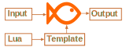

# BaFi
**Universal JSON, BSON, YAML, XML converter to ANY format using templates**

**Github repository**
- [https://github.com/mmalcek/bafi](https://github.com/mmalcek/bafi)

**Releases (Windows, MAC, Linux)**
- [https://github.com/mmalcek/bafi/releases](https://github.com/mmalcek/bafi/releases)

## Key features
- Various input formats **(json, bson, yaml, xml)**
- Flexible output formatting using text templates
- Support for [LUA](https://www.lua.org/pil/contents.html) custom functions which allows very flexible data manipulation
- stdin/stdout support which allows get data from source -> translate -> delivery to destination. This allows easily translate data between different web services like **REST to SOAP, SOAP to REST, REST to CSV, ...**



[](https://github.com/mmalcek/bafi/actions/workflows/go.yml)
[](https://goreportcard.com/report/github.com/mmalcek/bafi)
[](https://github.com/mmalcek/bafi/actions/workflows/codeql-analysis.yml)

## Command line arguments
- "-i input.xml" Input file name. If not defined app tries read stdin
- "-o output.txt" Output file name. If not defined result is send to stdout
- "-t template.tmpl" Template file. Alternatively you can use *inline* template 
    - inline template must start with **?** e.g. -t **"?{{.someValue}}"**
- "-f json" Alternative input format. 
    - Supported formats: **json, bson, yaml, xml (default)**
- "-v" - Show current verion
- "-?" - list available command line arguments

Example: ([more examples](examples/#command-line))
```
bafi.exe -i testdata.xml -t template.tmpl -o output.txt
```
## Templates
Bafi uses [text/template](https://pkg.go.dev/text/template). Here is a quick summary how to use. Examples are based on *testdata.xml* included in project

### Comments
```
{{/* a comment */}}
{{- /* a comment with white space trimmed from preceding and following text */ -}}
```

### Trim new line
New line before or after text can be trimmed by adding dash
```
{{- .TOP_LEVEL}}, {{.TOP_LEVEL -}}
```
### Accessing data
Data are accessible by *pipline* which is represented by dot

- Simplest template 
```
{{.}}
```
- Get data form inner node 
```
{{.TOP_LEVEL}}
```
- Get data from XML tag. XML tags are autoprefixed by dash and accessible as index
```
{{index .TOP_LEVEL "-description"}}
```
- Convert TOP_LEVEL node to JSON
```
{{toJSON .TOP_LEVEL}}
```

### Variables
You can store selected data to [template variable](https://pkg.go.dev/text/template#hdr-Variables)
```
{{$myVar := .TOP_LEVEL}}
```
### Actions
Template allows to use [actions](https://pkg.go.dev/text/template#hdr-Actions), for example

Iterate over lines
```
{{range .TOP_LEVEL.DATA_LINE}}{{.val1}}{{end}}
```
If statement 
```
{{if gt (int $val1) (int $val2)}}Value1{{else}}Value2{{end}} is greater
```

### Functions
In go template all data manipulation is done by using functions for example 

count val1+val2
```
{{add $val1 $val2}}
```
count (val1+val2)/val3
```
{{div (add $val1 $val2) $val3}}
```

There are 3 categories of functions
#### Native functions
text/template integrates [native functions](https://pkg.go.dev/text/template#hdr-Functions) to work with data

#### Additional functions
Asside of integated functions bafi contains additional common functions

- **add** - {{add .Value1 .Value2}}
- **add1** - {{add1 .Value1}} = Value1+1
- **sub** - substract
- **div** - divide
- **mod** - modulo
- **mul** - multiply
- **randInt**
- **add1f** - "...f" functions parse float but provide **decimal** operations using [shopspring decimal](https://github.com/shopspring/decimal)
- **addf**
- **subf**
- **divf**
- **mulf**
- **round** - {{round .Value1 2}} - will round to 2 decimals
- **max** - {{round .Value1 .Value2 .Value3 ...}} get Max value from range
- **min** - get Min value from range
- **maxf**
- **minf**
- **dateFormat** -> {{dateFormat .Value "oldFormat" "newFormat"}} - [GO time format](https://programming.guide/go/format-parse-string-time-date-example.html)
- **now** - {{now "02.01.2006"}} - GO format date (see notes below)
- **b64enc** - encode to base64
- **b64dec** - decode from base64
- **b32enc** - oncode to base32
- **b32dec** - decode from base32
- **uuid** - generate UUID
- **regexMatch** - {{regexMatch pattern .Value1}} more about go [regex](https://gobyexample.com/regular-expressions)
- **upper** - to uppercase
- **lower** - to lowercase
- **trim** - remove leading and trailing whitespace
- **trimPrefix** - {{trimPrefix "!Hello World!" "!"}} - returns "Hello World!"
- **trimSuffix** - {{trimSuffix "!Hello World!" "!"}} - returns "!HelloWorld"
- **trimAll** - {{trimAll "!Hello World!" "!"}} - returns "Hello World"
- **atoi** - {{atoi "42"}} - string to int
- **int** - {{int "42"}} - cast to int
- **int64** - {{int64 "42"}} - cast to int64
- **float64** - {{float64 "3.14159"}} - cast to float64
- **toJSON** - convert input object to JSON
- **toBSON** - convert input object to BSON
- **toYAML** - convert input object to YAML
- **toXML** - convert input object to XML
- **mapJSON** - convert stringified JSON to map so it can be used as object or translated to other formats (e.g. "toXML"). Check template.tmpl for example

#### Lua custom functions
You can write your own custom lua functions defined in ./lua/functions.lua file

Call Lua function in template ("sum" - Lua function name)
```
{{lua "sum" .val1 .val2}}
```

- Input is always passed as stringified JSON and should be decoded (json.decode(incomingData))
- Output must be passed as string
- lua table array starts with 1
- Lua [documentation](http://www.lua.org/manual/5.1/)

Minimal functions.lua example
```lua
json = require './lua/json'

function sum(incomingData) 
    dataTable = json.decode(incomingData)
    return tostring(tonumber(dataTable[1]) + tonumber(dataTable[2]))
end
```

Check [examples](/examples) and **template.tmpl** and **testdata.xml** for advanced examples

